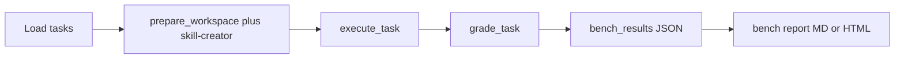

# EvoClawBench — Bench mode quick start

This guide covers **bench mode only** (`--mode bench`): the agent receives a **bench-specific prefix** (skill-creator workflow: recognize repetition, follow `skills/skill-creator/SKILL.md`, add reusable skills) **plus** the task prompt — not the baseline/evolution A/B prefixes. The workspace is seeded with the monorepo **`skills/skill-creator`** bundle. Composite metrics such as **EvoScore** and **fail2pass** are **not** computed in this mode (they require `--mode both`).

## Requirements

- Python **3.10+**
- [`uv`](https://github.com/astral-sh/uv) for the environment
- Repo layout: **`skills/skill-creator`** at the repository root, **sibling of** `evoclawbench/` (bench mode copies from `(repo)/skills/skill-creator` into each task workspace). If that directory is missing, preparation fails with `FileNotFoundError`.

## Install

```bash
cd evoclawbench
uv sync --extra dev
```

## Run (bench mode)

```bash
# Full suite, nanobot
uv run scripts/benchmark.py --model anthropic/claude-sonnet-4 --runtime nanobot --mode bench

# Subset of tasks
uv run scripts/benchmark.py --model anthropic/claude-sonnet-4 --runtime openclaw --mode bench \
  --suite task_01_batch_data_transform,task_02_log_analysis

# Statistical repeats (mean/std over grades per task)
uv run scripts/benchmark.py --model anthropic/claude-sonnet-4 --runtime nanobot --mode bench --runs 3

# Parallel workers (OpenClaw uses distinct agent IDs per worker when workers > 1)
uv run scripts/benchmark.py --model anthropic/claude-sonnet-4 --runtime openclaw --mode bench --workers 4
```

Useful flags:

| Flag | Purpose |
|------|---------|
| `--output-dir` | Results directory (default: `results`) |
| `--timeout-multiplier` | Scales task timeouts |
| `--judge` | Judge model for `llm_judge` / `hybrid` tasks |
| `--environment docker` | Isolated runs (`--docker-image`, default `evoclawbench/runtime`) |
| `--no-bench-report` | Skip Markdown/HTML report and terminal bench summary |
| `--no-progress` | Disable Rich live progress |
| `-v` / `--verbose` | Verbose logging |

### LLM providers

Routing matches the main [README.md](README.md) (“Configuring LLM Providers”). Typical variables:

- **OpenRouter**: `OPENROUTER_API_KEY`, optional `OPENROUTER_API_BASE`
- **Anthropic**: `ANTHROPIC_API_KEY`, optional `ANTHROPIC_API_URL`
- **OpenAI**: `OPENAI_API_KEY`, optional `OPENAI_API_BASE`

## What bench mode does (behavior)

1. **Bench prompt prefix** — `get_mode_prefix("bench")` returns `BENCH_PREFIX` prepended before **`task.prompt`** (see [`scripts/lib_agent.py`](scripts/lib_agent.py)).
2. **Workspace** — Under `evoclawbench/`, each run uses:
   - Root: `workspaces/{YYYY_MM_DD_HH_MM_SS}_bench/{run_id}/`
   - If `--runs` > 1: an extra level `{run_id}-bench-{k}/` per run index.
   - Per task: `{workspace_root}/{task_id}_bench/` (assets from `assets/`, `outputs/` pre-created, and in bench mode `skills/skill-creator/` copied from the monorepo). Orchestration: [`scripts/benchmark.py`](scripts/benchmark.py) `_run_single_mode`; layout: [`prepare_workspace`](scripts/lib_agent.py).
3. **`run_id` passed to the agent layer** — For each execution, `execute_task(..., run_id=ctx.trajectory_run_id)` with `trajectory_run_id = f"{run_id}-bench-{run_idx + 1}"` (1-based run number). That string is still passed into `prepare_workspace`; because **`workspace_root` is always set** by `benchmark.py` for orchestrated runs, the on-disk path is **`workspace_root / "{task_id}_bench"`**, not `/tmp/evoclawbench/{trajectory_run_id}/...`.
4. **OpenClaw post-check** — After a bench run, [`_verify_bench_skills_loaded`](scripts/lib_agent.py) reads `~/.openclaw/agents/<agent>/sessions/sessions.json` and warns if **skill-creator** does not appear in the reported loaded skills. This is diagnostic only (run does not fail). **nanobot** has no equivalent check.



## Metrics and scoring (bench)

### Top-level JSON aggregate

- **`bench_results`**: Per-task payloads (grades, execution results, mean score across `--runs`, optional `created_skills`, `skill_quality_score`).
- **`metrics`**: In bench-only runs this object is **empty** `{}` — no EvoScore, fail2pass, or cross-mode consistency (see [`scripts/benchmark.py`](scripts/benchmark.py): `aggregate_metrics` runs only for `--mode both`).
- **`baseline_results` / `evolution_results`**: Empty objects when `--mode bench`.

### Per-task grading (unchanged by mode)

[`grade_task`](scripts/lib_grading.py) uses each task’s `grading_type`:

- **automated** — Runs embedded `grade(transcript, workspace_path)`; numeric breakdown keys **`sub_N_*`** are aggregated into **`sub_problem_scores`**; overall score is derived via `_average_scores` (typically `max_score` 1.0).
- **llm_judge** / **hybrid** — LLM rubric and/or merge with automated; `--judge` selects the judge model when applicable.

### Bench report summary (terminal + `.bench-report.md` / `.bench-report.html`)

Built by [`build_bench_report`](scripts/lib_bench_report.py) from `bench_results`:

| Field | Definition |
|-------|------------|
| **Mean score %** | Mean over tasks of `(mean_score / max_score) * 100`; `mean_score` averages grades when `--runs` > 1. |
| **Total tokens / cost** | Sum over tasks of per-run **`usage`** (`_sum_usage_across_runs`). |
| **Skills detected** | Count of **`skills/<name>/SKILL.md`** entries **excluding** seeded names; bench excludes **`skill-creator`** via [`BENCH_SEEDED_SKILL_NAMES`](scripts/lib_agent.py). |
| **Skill quality (heuristic)** | [`grade_skill_quality`](scripts/lib_grading.py): per-skill checklist (frontmatter, content length, `scripts/`, `references/`), averaged across detected non-seed skills; **0** if none. |

Per-task sections in the report include `sub_problem_scores`, numeric **breakdown**, **exit_code**, **timed_out**, **workspace** path, and notes when present.

## Artifacts

After a successful run (default `results/`, four-digit `run_id`, `model_slug` from the model id):

| Artifact | Description |
|----------|-------------|
| `{run_id}_{model_slug}_{runtime}.json` | Full aggregate (including `bench_results`) |
| `{run_id}_{model_slug}_{runtime}.trajectories.json` | Trajectory bundle from [`save_trajectories`](scripts/benchmark.py) |
| `{run_id}_{model_slug}_{runtime}.bench-report.md` | Human-readable Markdown report |
| `{run_id}_{model_slug}_{runtime}.bench-report.html` | HTML report |

Logs also append to **`benchmark.log`** in the current working directory (typically `evoclawbench/` when invoked from there).

## Troubleshooting

1. **`FileNotFoundError` for skill-creator** — Ensure `<repo>/skills/skill-creator` exists next to `evoclawbench/`.
2. **All scores 0%** — Confirm API keys, runtime install (`openclaw` / `nanobot`), workspace write access, and that task **outputs** match what **Automated Checks** expect (`sub_N_*` keys, numeric 0–1). Run a single task with `-v`:  
   `uv run scripts/benchmark.py --model ... --runtime ... --mode bench --suite task_00_sanity -v`
3. **OpenClaw: “skill-creator NOT found in sessions.json”** — Workspace may still have the tree; OpenClaw may not have exposed it in the session index. Verify `skills/skill-creator` under the reported **workspace** path and agent discovery settings.
4. **No EvoScore in JSON** — Expected for bench-only; use mean score % and per-task breakdowns in the bench report and `bench_results`.

## Source reference

| Area | File |
|------|------|
| CLI, aggregate JSON, bench report invocation | [`scripts/benchmark.py`](scripts/benchmark.py) |
| Modes, workspace, runtimes, bench skill verify | [`scripts/lib_agent.py`](scripts/lib_agent.py) |
| Grading and skill quality heuristic | [`scripts/lib_grading.py`](scripts/lib_grading.py) |
| Bench report numbers and rendering | [`scripts/lib_bench_report.py`](scripts/lib_bench_report.py) |
| fail2pass / EvoScore (not used in bench-only) | [`scripts/lib_metrics.py`](scripts/lib_metrics.py) |
