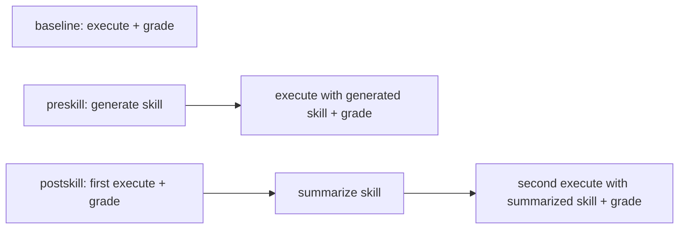

# EvoClawBench Quick Start

This guide covers the current three-way benchmark:

- `baseline`: execute a task directly without creating or editing skills.
- `preskill`: generate skills first, then execute with those skills in a fresh workspace.
- `postskill`: execute once, summarize skills from that run, then execute the same task again.

The default `--mode all` runs all three.

## Install

```bash
cd evoclawbench
uv sync --extra dev
```

`preskill` and `postskill` skill-authoring phases require the repository-level
`skills/skill-creator/` bundle next to `evoclawbench/`.

## Run

```bash
# Full three-way benchmark
uv run scripts/benchmark.py --model anthropic/claude-sonnet-4 --runtime nanobot

# Explicit full mode
uv run scripts/benchmark.py --model anthropic/claude-sonnet-4 --runtime openclaw --mode all

# One mode only
uv run scripts/benchmark.py --model anthropic/claude-sonnet-4 --runtime nanobot --mode baseline
uv run scripts/benchmark.py --model anthropic/claude-sonnet-4 --runtime nanobot --mode preskill
uv run scripts/benchmark.py --model anthropic/claude-sonnet-4 --runtime nanobot --mode postskill

# Subset of tasks
uv run scripts/benchmark.py --model anthropic/claude-sonnet-4 --runtime openclaw \
  --suite task_01_batch_data_transform,task_02_log_analysis

# More stable aggregate numbers
uv run scripts/benchmark.py --model anthropic/claude-sonnet-4 --runtime nanobot --runs 3
```

Useful flags:

| Flag | Purpose |
|------|---------|
| `--mode all|baseline|preskill|postskill` | Select the benchmark mode |
| `--suite` | `all` or comma-separated task ids |
| `--output-dir` | Results directory, default `results` |
| `--timeout-multiplier` | Scale task timeouts |
| `--judge` | Judge model for `llm_judge` / `hybrid` tasks |
| `--workers` | Parallel task pipelines, default `4` |
| `--environment docker` | Run commands in Docker (`--docker-image`) |
| `--no-progress` | Disable Rich live progress |
| `-v` / `--verbose` | Verbose logging |

## What Each Mode Does



Skill reuse execution phases copy only generated skills into the new workspace. The seeded
`skill-creator` bundle is excluded. Skill files are hashed before and after reuse execution; any
skill mutation is recorded as `skill_mutation_violation=true`.

Postskill writes `.evoclawbench/first_run_context.json` after the first pass. The summary phase
uses that file to create reusable skills, then the second pass runs the same task and fixtures.

## Metrics

The aggregate JSON includes two performance scopes:

| Scope | What it counts |
|-------|----------------|
| `execution_only` | Only the task execution being compared |
| `end_to_end` | Full workflow cost, including skill generation or summary |

Both scopes include mean scores, token/cost/time usage, ratios versus baseline, and efficiency
versus baseline. `metrics.postskill` includes first-pass mean, second-pass mean, and
second-vs-first delta/ratio.

## Artifacts

Default output names:

| Artifact | Description |
|----------|-------------|
| `{run_id}_{model_slug}_{runtime}.json` | Aggregate results and metrics |
| `{run_id}_{model_slug}_{runtime}.trajectories.json` | Transcripts, workspace previews, grading details |

Logs append to `benchmark.log` in the current working directory.

## Troubleshooting

- Missing `skill-creator`: ensure `<repo>/skills/skill-creator` exists next to `evoclawbench/`.
- All scores are zero: run one task with `-v`, inspect the reported workspace, and compare files
  under `outputs/` with the task's automated checks.
- Skill mutation violations: inspect the reuse execution workspace and compare
  `skill_hash_before` / `skill_hash_after` in the result JSON.
